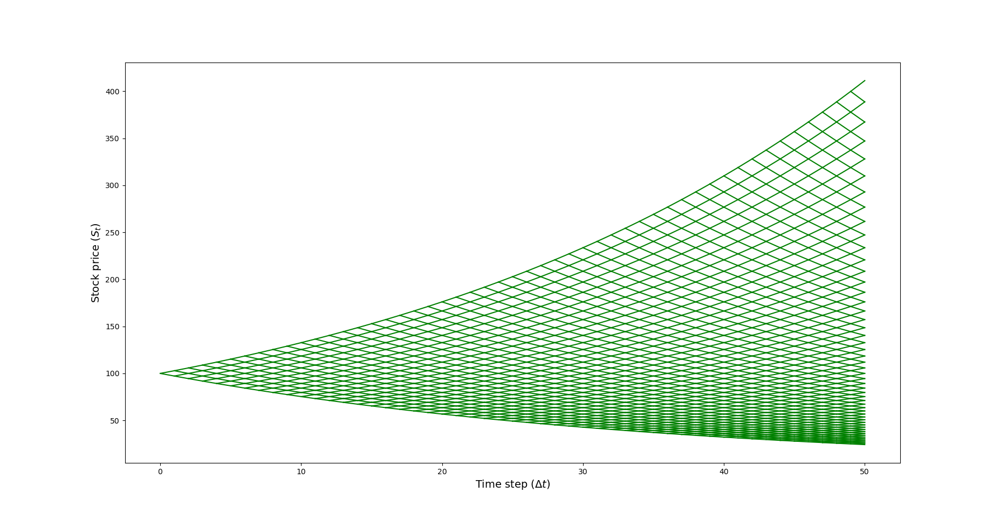
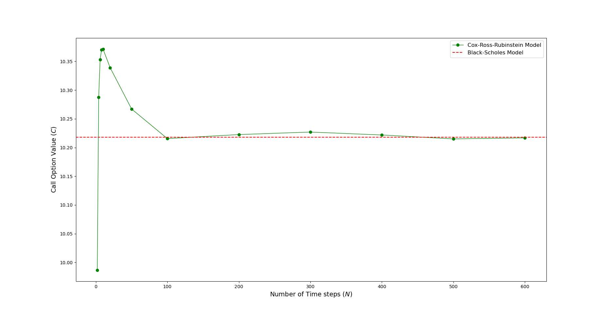
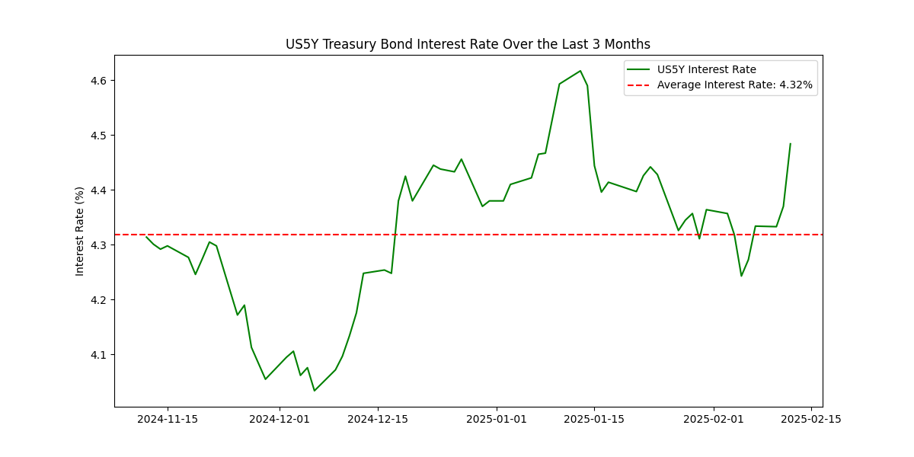
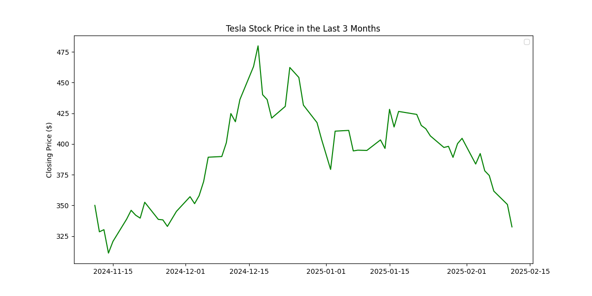
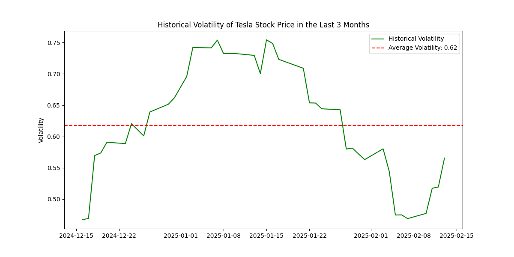
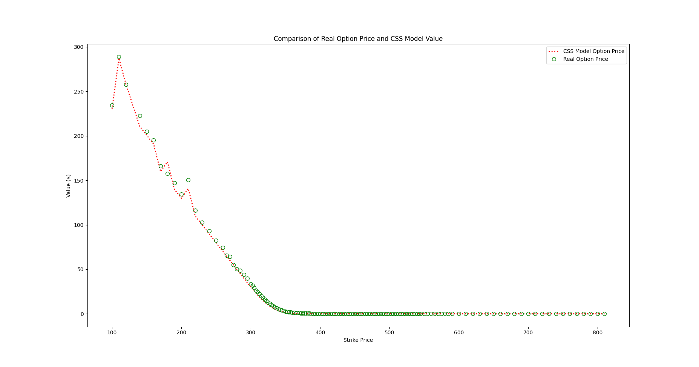

**Project Title**: Quantitative Finance Toolkit

**Description**:

This repository contains a collection of Python scripts for quantitative finance analysis. The included files implement option pricing models, visualizations of historical stock and interest rate data, and comparisons between real-world data and theoretical models.

**Repository Contents**:

* **`CRR.py`**: Implementation and visualization of a binomial tree based on the Cox–Ross–Rubinstein (CRR) model, comparison with the Black-Scholes model, and error plots against the number of steps.
* **`r_US5.py`**: Downloads and visualizes the historical yield of the 5-year U.S. Treasury bond (`^FVX` ticker), calculates and displays the average rate over the past 3 months.
* **`Serie_Storiche_Tesla.py`**: Retrieves Tesla's (`TSLA`) historical closing data over a 3-month period, computes returns, historical volatility, and visualizes price and volatility charts.
* **`Testing_CSS.py`**: Application example of the CRR model for Tesla's option market data, retrieves real data via `yfinance`, computes historical volatility, and compares real vs. theoretical option prices.
* **`greeks.py`**: Implements the Black-Scholes formula for pricing European call and put options and computes the main Greeks:

  * **Delta**: sensitivity of the option price to the underlying price
  * **Gamma**: sensitivity of Delta to the underlying price
  * **Vega**: sensitivity to volatility
  * **Theta**: change in option price with respect to time
  * **Rho**: sensitivity to the interest rate

  Displays:

  * The behavior of the Greeks as a function of the underlying price
  * Comparison between call and put options

  **Example usage**:

  ```bash
  python greeks.py
  ```

  Configurable parameters inside the script:

  * `S`: current price of the underlying (e.g., 100)
  * `K`: strike price (e.g., 105)
  * `T`: time to maturity (in years)
  * `r`: continuous interest rate (e.g., 0.05)
  * `sigma`: implied volatility (e.g., 0.2)

---

## Requirements

* Python 3.8 or higher
* Python packages:

  * `numpy`
  * `scipy`
  * `matplotlib`
  * `pandas` (for scripts using DataFrame)
  * `yfinance` (for downloading financial data)

You can install the dependencies with:

```bash
pip install numpy scipy matplotlib pandas yfinance
```

---

## Usage

Below are descriptions and usage instructions for each script.
---

### 1. `CRR.py`

This script implements:

* Construction of a price matrix via the binomial tree
* Pricing of a European call option using backward induction (CRR)
* Pricing with the Black-Scholes formula
* Plots:

  * Labeled binomial tree (`CSS_Binomial_Tree_Labeled_PLOT`)
  * Simple binomial tree (`CSS_Binomial_Tree_PLOT`)
  * Call value vs. N (`Call_vs_N_PLOT`)
  * Percentage error vs. N (`Err_Call_vs_N_PLOT`)

**Example usage**:

```bash
python CRR.py
```

Configurable parameters inside the script:

* `r`: continuous interest rate (e.g., 0.05)
* `sigma`: volatility (e.g., 0.4)
* `T`: time to maturity (in years)
* `S0`: initial price of the underlying (e.g., 100)
* `X`: strike price (e.g., 105)
* `Ns`: array of time steps to test convergence

---

### 2. `r_US5.py`

This script:

* Uses `yfinance` to download daily yield data for the 5-year U.S. Treasury bond (`^FVX`) over the past 3 months
* Computes the average yield over the period
* Displays a yield plot with a reference line for the average value

**Example usage**:

```bash
python r_US5.py
```

**Note**: the `^FVX` ticker reports daily yield in percentage.

---
### 3. `Serie_Storiche_Tesla.py`

This script:

* Downloads daily closing prices of `TSLA` over the past 3 months
* Computes daily percentage returns
* Computes historical volatility with a 21-day rolling window, annualized
* Displays:

  * Closing price chart
  * Historical volatility chart with a mean reference line

**Example usage**:

```bash
python Serie_Storiche_Tesla.py
```
---

### 4. `Testing_CSS.py`

This script:

* Implements the `CSS_Call` function for option pricing via a binomial tree
* Retrieves Tesla's option data using `yfinance`
* Computes time to maturity (in years) from `lastTradeDate`
* Extracts volatility and spot price on the trade day for each option
* Compares real call prices with theoretical values from the CRR model
* Displays a comparison chart

**Example usage**:

```bash
python Testing_CSS.py
```

---

## Data Structure and Modules

Each script is standalone and can be executed independently. Shared modules (e.g., pricing functions) could be organized into a dedicated package to promote reuse.

---

## Output Examples

Below are some example plots generated by the scripts:








---


